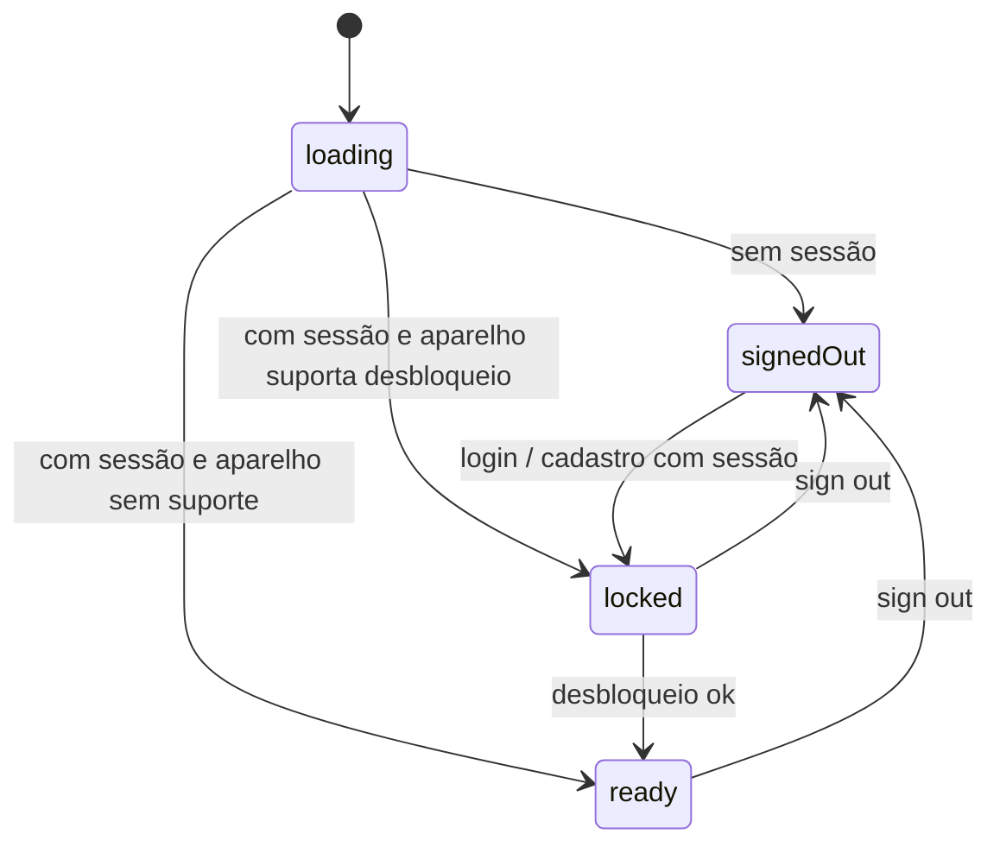

# Fluxo de telas e autenticação

O acesso ao app tem duas etapas:

1. **Conta no Supabase**: email e senha, feito uma vez. A sessão fica salva no Keychain.
2. **Desbloqueio do aparelho**: Face ID, Touch ID ou código, a cada vez que o app é aberto.

## O portão de autenticação (`AuthGate`)

O provider `authGateProvider` (`lib/app/providers.dart`) junta três sinais e decide em que estado o app está:

| Sinal | Origem |
| --- | --- |
| Sessão | `authSessionProvider`: sessão atual do Supabase e o stream `onAuthStateChange`. |
| Suporte a desbloqueio | `deviceSupportedProvider`: `LocalAuthentication.isDeviceSupported()`. |
| Desbloqueado | `unlockedProvider`: um booleano em memória, começa `false`. |

Regras:

- Enquanto a sessão ou o suporte do aparelho estão carregando: `loading`.
- Sem usuário (ou usuário sem email): `signedOut`.
- Com usuário, aparelho com suporte e ainda não desbloqueado: `locked`.
- Caso contrário: `ready`.

Se o aparelho não tem nenhuma forma de desbloqueio, o app vai direto para `ready`.

## Rotas

Definidas em `lib/app/router.dart`. A função `redirectFor` leva o usuário para a tela certa conforme o `AuthGate`. O router é reavaliado sempre que o `AuthGate` muda.

| Rota | Tela | Quando |
| --- | --- | --- |
| `/loading` | `LoadingPage` (spinner) | `AuthGate.loading` |
| `/login` | `LoginPage` | `AuthGate.signedOut` |
| `/unlock` | `UnlockPage` | `AuthGate.locked` |
| `/pets` | `PetsPage` | `AuthGate.ready` |
| `/pets/new` | `PetPage` sem id (novo pet) | `AuthGate.ready` |
| `/pets/:id` | `PetPage` com id (detalhes) | `AuthGate.ready` |

Em `ready`, quem estiver em `/login`, `/unlock` ou `/loading` é levado para `/pets`. Nos outros estados, qualquer rota leva para a tela do estado.

## Login e cadastro (`LoginPage`)

- A mesma tela alterna entre "Sign in" e "Create account".
- `AuthRepository` valida antes de chamar o Supabase: email com formato válido e senha com pelo menos 6 caracteres. O email é normalizado (sem espaços, minúsculo).
- No cadastro, se o Supabase não devolver sessão (confirmação de email ligada), a tela volta para o modo de login e pede para confirmar o email.
- Erros do Supabase viram `AppFailure` e aparecem em vermelho na tela.
- Sem configuração do Supabase, os campos ficam desabilitados e a tela explica como criar o `dart_defines.json`.

Quando o login dá certo, o stream de autenticação emite o usuário, o `AuthGate` muda e o router redireciona. A tela de login não navega sozinha.

## Desbloqueio (`UnlockPage`)

- Ao abrir, a tela já pede o desbloqueio (`DeviceLock.unlock`).
- Aceita biometria ou código do aparelho (`biometricOnly: false`).
- Se o usuário cancelar, aparece "Authentication was canceled." e o botão "Unlock" permite tentar de novo.
- Se o aparelho não tem código configurado, a mensagem pede para configurar um.
- Também há um botão "Sign out".

O estado "desbloqueado" fica só em memória. Ele volta a `false` quando o app é encerrado e reaberto, ou no sign out. Mandar o app para segundo plano e voltar **não** bloqueia de novo.

## Sessão no Keychain

`SecureSessionStorage` (`lib/core/supabase/secure_session_storage.dart`) substitui o armazenamento padrão do Supabase. A sessão é gravada no Keychain com a chave `sb-<project-ref>-auth-token`. O Supabase cuida da renovação do token.

## Sign out

`signOut` (`lib/features/auth/presentation/sign_out.dart`) encerra a sessão no Supabase e volta `unlockedProvider` para `false`. O `AuthGate` vai para `signedOut` e o router leva ao login. O banco local **não** é apagado (veja [Limitações](sincronizacao.md#limitações-conhecidas)).
