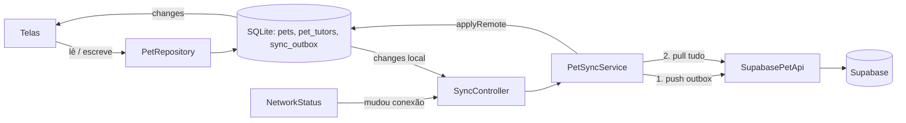

# Armazenamento local e sincronização

O app funciona primeiro no aparelho. Toda leitura vem do SQLite e toda escrita vai para o SQLite. A sincronização com o Supabase acontece por trás, quando há sessão e internet.

## Banco local

Arquivo `bowie.db`, criado por `PetLocalStore` (`lib/features/pets/data/pet_local_store.dart`). Tabelas:

- `pets` e `pet_tutors`: espelho das tabelas do servidor.

O banco tem versão: a 1 criou as tabelas, a 2 acrescentou o perfil do pet, a 3 a tabela `pet_vaccines`, a 4 o sexo e a foto do pet, a 5 a lista de compras (`shopping_items`), a 6 o diário (`pet_events`) e os contatos (`house_contacts`). Quem atualiza o app tem o banco migrado ao abrir (`onUpgrade` em `PetLocalStore.open`), sem perder dados.
- `sync_outbox`: alterações que ainda não subiram. Colunas `entity` (`pets`, `pet_tutors`, `pet_vaccines` ou `pet_photos`), `entity_id`, `payload` (o registro em JSON) e `created_at`. Em `pet_photos`, o `entity_id` é o caminho da foto e o `payload` diz se é para enviar (`upload`) ou remover (`remove`) o arquivo.

As fotos dos pets ficam em arquivos, fora do banco: pasta `pet_photos` nos documentos do app (`PetPhotoStore`).

A outbox tem índice único em `(entity, entity_id)`. Se o mesmo registro é alterado duas vezes antes de subir, fica só a última versão.

Toda gravação local atualiza a tabela e a outbox na mesma transação e emite um evento no stream `changes` (`ChangeReason.local`). Dados vindos do servidor emitem `ChangeReason.remote`.

## Quando a sincronização roda

`SyncController` (`lib/features/pets/data/pet_sync_controller.dart`) dispara `sync()` quando:

1. O `AuthGate` passa a `ready` (depois do login ou do desbloqueio).
2. Há uma alteração local.
3. A conectividade muda (por exemplo, o aparelho volta a ficar online).
4. O usuário toca no botão de sincronizar em `/pets`.

Não há sincronização periódica nem ao voltar do segundo plano. Alterações feitas por outra pessoa só aparecem quando um desses eventos acontece.

`PetSyncService` evita execuções em paralelo: se um `sync()` chega com outro em andamento, ele reaproveita o que está rodando e marca para rodar mais uma vez no final.

## Um ciclo de sincronização

`PetSyncService._once` (`lib/features/pets/data/pet_sync_service.dart`):

1. Sem Supabase configurado ou sem sessão: termina como `SyncSkipped`.
2. Offline: termina como `SyncWaiting`, com a mensagem "Salvo no celular. Sincroniza quando a internet voltar." se houver pendências, ou "Você está sem internet. Mostrando o que está salvo no celular." se não houver.
3. **Push**: envia a outbox, primeiro os `pets`, depois os `pet_tutors`, depois as fotos (`pet_photos`, para o Storage), as `pet_vaccines`, os `shopping_items`, os `house_contacts` e os `pet_events` (contatos antes do diário, porque um registro pode apontar para um contato), e dentro de cada grupo por ordem de criação. Uma foto trocada antes de subir já não está no celular e é pulada. Pets vão antes para que o servidor já conheça o pet (e o vínculo da pessoa) quando receber o que aponta para ele.
   - Depois de cada envio, o item sai da outbox, mas só se o `payload` ainda for o mesmo que foi enviado. Se o usuário alterou o registro durante o envio, a nova versão continua na fila.
   - No primeiro erro, o push para e o ciclo termina.
4. **Pull**: baixa todos os `pets`, `pet_tutors`, `pet_vaccines`, `shopping_items`, `house_contacts` e `pet_events` que o usuário pode ver (de 200 em 200, ordenados por `updated_at` e `id`) e aplica no SQLite.
5. Termina como `SyncOk`.

### Como cada registro é enviado

`SupabasePetApi._save` (`lib/features/pets/data/pet_remote_api.dart`) faz um **update pelo id e, se nada foi atualizado, um insert**. Um upsert simples não funcionaria: o Postgres checaria a política de insert contra a linha final, e isso rejeitaria a aceitação de um convite. Se o insert falhar com chave duplicada (`23505`), tenta o update de novo.

### Como o pull é aplicado

`PetLocalStore.applyRemote`:

- Registros com alteração pendente na outbox são ignorados. A versão local vence até subir.
- Vínculos de tutor só entram se o pet correspondente existir localmente.
- Os demais sobrescrevem a cópia local. Depois que a alteração sobe, o que vale é o que o servidor devolve.

## Resultado e mensagens

| Resultado | Quando | O que a tela mostra |
| --- | --- | --- |
| `SyncOk` | Push e pull concluídos | Nada; atualiza `lastSyncedAt`. |
| `SyncSkipped` | Sem Supabase ou sem sessão | Nada. |
| `SyncWaiting` | Offline ou erro de rede (`AppFailure.retryable`) | Faixa azul com a mensagem. |
| `SyncFailed` | Erro do servidor, como violação de RLS | Faixa vermelha com a mensagem. |

Erros de rede (`SocketException`, timeout, falha de DNS) viram "Sem conexão com o servidor. As alterações ficam salvas no celular." e são tratados como temporários. Recusas do servidor (como uma regra de RLS) viram "O servidor recusou uma alteração. Tente de novo mais tarde."

## Limitações conhecidas

- **Sem sincronização periódica.** Mudanças de outras pessoas só chegam com um dos gatilhos acima.
- **O pull não remove registros.** Se o servidor deixar de devolver uma linha (por exemplo, porque o acesso foi revogado no banco), a cópia local continua lá.
- **O banco local não é limpo no sign out.** As telas filtram pelo email do usuário, então outra conta não vê os pets da anterior. Mas a outbox continua, e pendências de uma conta seriam enviadas com a sessão da próxima, onde o RLS as rejeita e o push para nesse item.
- **Um item rejeitado trava a fila.** Como o push para no primeiro erro, um item que o servidor sempre recusa impede os seguintes de subir.
- **Conflitos simples.** Não há comparação de `updated_at` entre aparelhos: a última escrita que chega ao servidor prevalece.
